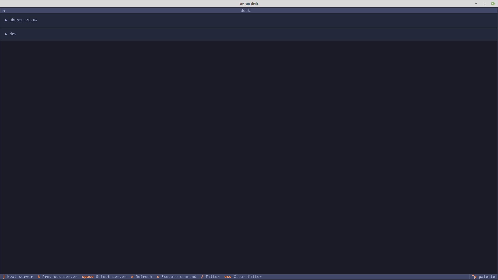
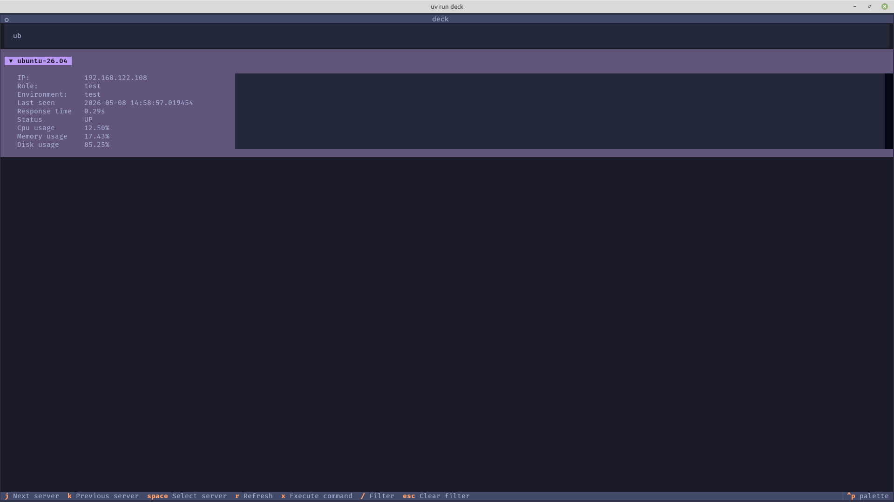
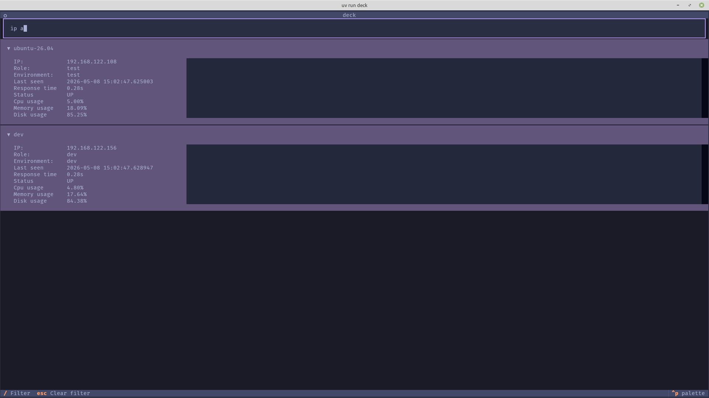
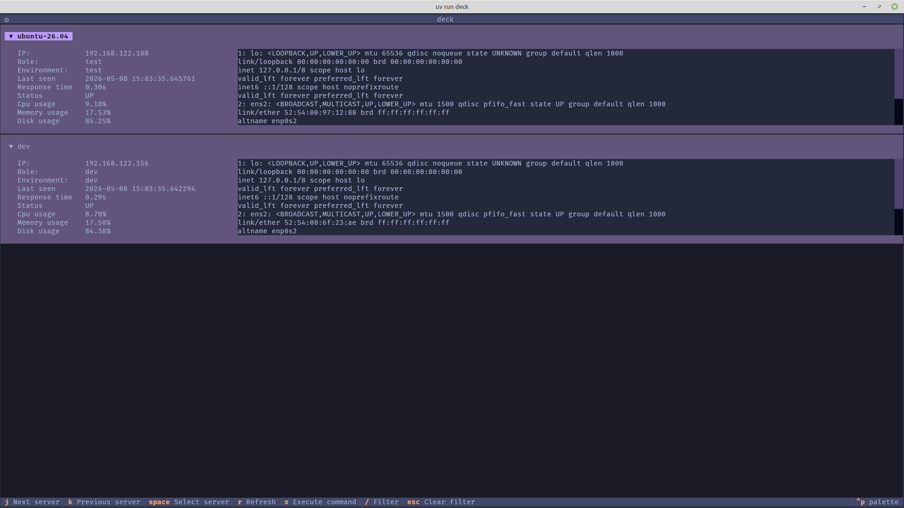

# Deck

A TUI tool for managing servers. Primary purpose is to brush up on Python.

## Setup

This project depends on `uv` ([`uv` installation instructions](https://docs.astral.sh/uv/getting-started/installation/)).

Then run

```bash
uv venv
source .venv/bin/activate
```

`deck` uses a file `~/.config/deck/inventory.toml` to read server configuration.

```toml
[[servers]]
hostname = "prod-web-01"
ip = "10.0.1.10"
role = "web"
env = "prod"
ssh_user = "admin"
ssh_port = 22

[[servers]]
hostname = "prod-db-01"
ip = "10.0.1.20"
role = "db"
env = "prod"
ssh_user = "admin"
ssh_port = 22
```

To start the tool, run

```bash
uv run deck
```

## Usage

Deck reads servers listed in `inventory.toml` and displays them in a list.



To move up in the list press `j` and to move down press `k`.

You can filter servers depending on their hostname, select multiple servers
and refresh their status manually.



You can run arbitrary shell commands on multiple servers simultaneously by
selecting different servers, pressing `x` and typing in a shell command.





All commands are displayed in the footer.

## Roadmap

- Better error handling
- Service management (control `systemctl` services through Deck)
